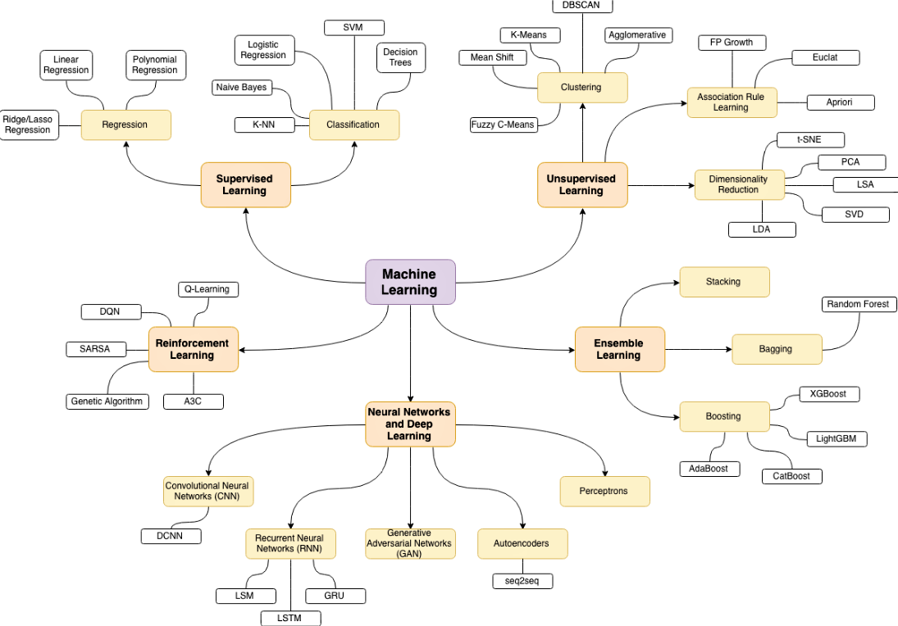

# Machine Learning Projects

<p align="center">
  <a href="https://github.com/dineshyadav3169/machine-learning">
    
    
  </a>
</p>

---
## Table of Contents
- [Salary Prediction](https://github.com/dineshyadav3169/machine-learning/tree/new/Regression/Salary%20Prediction)
- [Loan Prediction](https://github.com/dineshyadav3169/machine-learning/tree/new/Classification/Loan%20Prediction)
- [Iris-Classification](https://github.com/dineshyadav3169/machine-learning/tree/new/Classification/Iris%20Detection)
- [Iris-Clustering](https://github.com/dineshyadav3169/machine-learning/tree/new/Clustering/Iris%20Clustering)
- [Brest Cancer detection](https://github.com/dineshyadav3169/machine-learning/tree/new/Classification/Breast%20Cancer%20Detection)
- [Chronic Kidney Disease](https://github.com/dineshyadav3169/machine-learning/tree/new/Artificial%20Neural%20Networks/Chronic%20Kidney%20Disease)
- [Diabetes Prediction System](https://github.com/dineshyadav3169/machine-learning/tree/new/Classification/Diabetes%20Prediction)

---

## Machine Learning Map




## Prerequisites

#### Installing Python

Make sure that you have [Python](https://realpython.com/installing-python/) installed on your machine.

You might want to use [venv](https://docs.python.org/3/library/venv.html) standard Python library
to create virtual environments and have Python, `pip` and all dependent packages to be installed and 
served from the local project directory to avoid messing with system wide packages and their 
versions.

#### Launching Jupyter Locally

To launch [Jupyter Notebook](http://jupyter.org/) locally you may do it by running the following command from the root folder of the project:

```bash
jupyter notebook
```
After this Jupyter Notebook will be accessible by `http://localhost:8888`.

## Datasets

The list of datasets that is being used for Jupyter Notebook can be found [here](https://archive.ics.uci.edu/ml/datasets.php).
 
# To-Do List
- [x] Salary Prediction
- [x] Loan Prediction
- [x] Iris
- [x] Brest Cancer detection
- [x] Chronic Kidney Disease
- [ ] Football game prediction
- [x] Diabetes Prediction
- [ ] Email Spam Classifier
- [ ] Movie Recommender
- [ ] TMDB 5000 Movie
- [ ] NBA Exploration
- [ ] NPL Restaurant Reviews
- [ ] New York City Airbnb

Please, feel free to make any contributions you feel will make it better.
